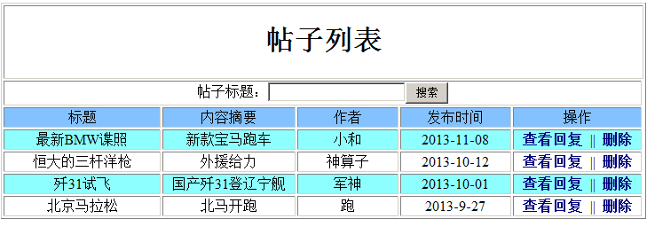
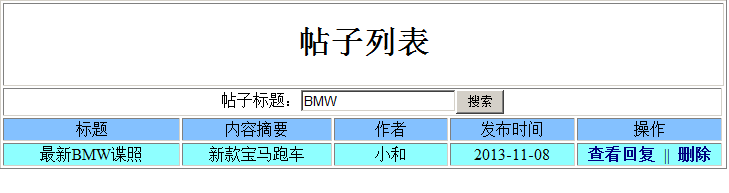
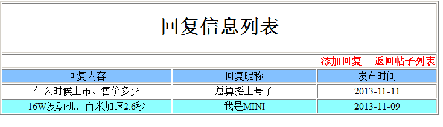
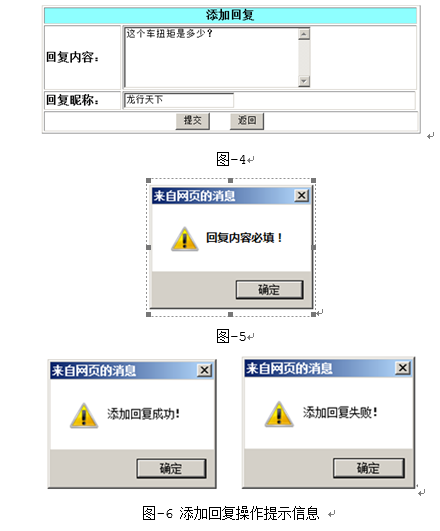
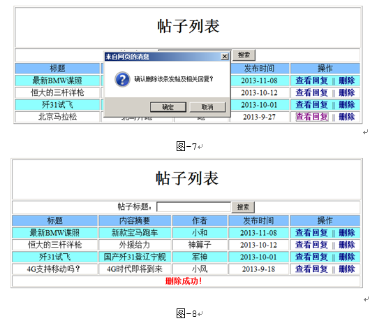

# 论坛发帖管理系统
- 技术要求：IDEA、Maven、Spring、JDBC、MySQL、LogBack、AJAX

## 项目功能：
### 1.查看所有的发帖信息功能。
打开论坛发贴管理系统首页，使用Ajax异步请求后台方法，默认显示全部的发帖信息，按照发布时间降序排列，日期的显示形式为“年-月-日”，帖子列表隔行变色。
如下图-1：
### 2.查询帖子功能。
查询帖子功能。输入帖子的标题，使用Ajax异步请求后台方法，根据输入内容对帖子标题进行模糊查询并展示符合条件的帖子，并且输入框能够记忆查询的条件。如图-2所示。
### 3.查看回复功能。
点击“查看回复”链接，跳转到回复信息列表页面，使用Ajax异步请求后台方法查询数据，显示此帖子下所有回复，并提供“返回帖子列表”、“添加回复”的链接，如图-3所示。
点击“返回帖子列表”链接时，返回到查看所有帖子列表的页面，页面效果如图-1所示。
### 4.添加回复功能。
在回复信息列表页面，点击“添加回复”超链接，跳转到增加回复的页面，如图-4所示。其中回复内容为必填项，保存时如果回复内容未填，需给出提示，如图-5所示，回复时间默认为当前时间，如果没有填写回复人昵称，则默认为“匿名用户”，要求无论添加成功或失败，都要给出提示信息，如图-6所示，点击确定后再次跳转到回复信息列表页面。
### 5.删除帖子功能。
在帖子列表页面，点击“删除”超链接时，给出删除提示信息，如：“确定删除该条发贴及相关回复？”，如图-7所示。确认后使用Ajax请求后台方法处理，删除指定的帖子及其所关联的回复记录，根据执行结果，列表下方显示“删除成功”或“删除失败”提示语句，如图-8所示。

## 数据库设计
### 帖子表 Post
| 序号 | 字段名称 | 字段说明 | 类型 | 属性 | 备注 |
|:---:|:--- |:--- | :---: | :--- | :--- |
| 1 | id | 帖子编号 | 长整数 | 主键 | 备注 | 使用自动增长属性赋值 |
| 2	| title	| 帖子标题 | 字符串 | 非空	 |
| 3	| summary | 帖子摘要 | 字符串 |
| 4	| author | 作者 | 字符串 | 		
| 5	| createDate | 发布时间 | 日期 | 非空 |
### 回复表 Reply
| 序号 | 字段名称 | 字段说明 | 类型 | 属性 | 备注 |
|:---:|:--- |:--- | :---: | :--- | :--- |
| 1	| id | 编号 | 长整数 | 主键 | 使用自动增长属性赋值 | 
| 2	| postId | 帖子编号 | 长整数 | 非空 | 对应帖子表的主键 | 
| 3	| content | 回复内容 | 字符串 | 非空 | 
| 4	| author | 回复人昵称 | 字符串 |  | 默认“匿名用户” | 
| 5	| createDate | 发布时间 | 日期 | 非空	 | 

## 具体要求及推荐实现步骤
1. 建立数据表，设置约束，并且添加测试数据（每表至少4条）；
2. 使用IDEA创建Maven项目，命名为PM；
3. 使用Spring + MySQL搭建项目框架；
4. 正确配置框架集成；
5. 创建持久化类、SQL映射文件；   
6. 创建DAO接口定义底层数据库操作，并在相应SQL映射文件中实现相应的操作；
7. 创建Service接口及其实现类，实现相应业务，并在类中加入DAO引用;
8. 创建并配置控制器，在类中加入Service的引用，调用业务类完成指定功能，对结果和消息进行保存并导航到指定页面完成显示;
9. 完成相关对象的声明和装配（注：不能使用XML配置的方式），并为业务对象添加声明式事务支持，以代码方式实现事务不得分；;
10. 帖子列表显示页面：
    1. 按照图-1进行页面设计;
    1. 使用Ajax调用控制器类中的方法，默认按发布时间降序查询所有的帖子列表;
    1. 发布时间按“年-月-日”显示结果;
    1. 提供“查看回复”、 “删除”链接;
11. 查看回复页面：
    1. 按照图-3进行页面设计;
    1. 使用Ajax请求后台方法获取帖子对应的回复信息；
    1. 提供“返回帖子列表”、“添加回复”的链接;
12. 添加回复页面：
    1. 按照图-4进行页面设计;
    1. 点击“提交”按钮能够提交到正确的控制器;
    1. 保存时回复时间默认为当前时间，并能够正确保存对应帖子的ID;
    1. 无论保存成功还是失败，均要给出提示信息，如图-6所示;
    1. 点击“确定”按钮后跳转到相应回复列表，如图-3所示。
13. 删除帖子功能：
    1. 使用Ajax异步请求后台方法删除帖子；
    1. 删除前要弹出确认删除信息的提示，如图-7所示;
    1. 删除帖子的同时把与该贴相关的回复信息一并删除，删除后跳转到帖子列表页面，并给出删除成功或者失败的提示信息，如图-8所示。
14. 调试运行成功后导出SQL语句，其中包括表结构（包括主键和约束）、初始化数据。生成SQL脚本文件与代码文件一同提交。没有数据库文件或以其它文件类型提交，数据库项不得分。